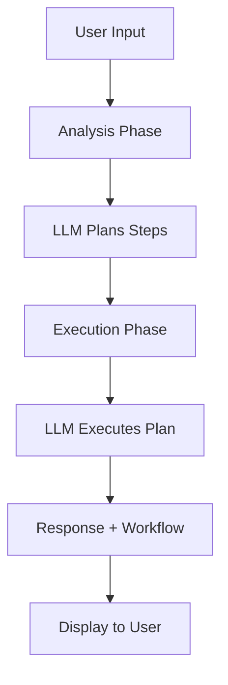

# AI Agentic Assistant - Cloudflare Pages

A production-ready AI agent powered by Llama 3.3 on Cloudflare Workers AI with multi-step reasoning, conversation memory, and voice input capabilities.

## 🌟 Features

- **🤖 Agentic Workflow**: Multi-step reasoning with visible thinking process
- **💬 Chat Interface**: Clean, modern UI with real-time messaging
- **🎤 Voice Input**: Speech-to-text using Web Speech API
- **🧠 Memory**: Maintains conversation context across messages
- **⚡ Serverless**: Runs on Cloudflare Pages + Workers AI (no servers to manage)
- **🆓 Free Tier**: Works within Cloudflare's generous free limits

## 📋 Requirements

- Node.js 16+ installed
- A Cloudflare account (free tier works!)
- Basic command line knowledge

## 🚀 Quick Start

### 1. Install Wrangler CLI

```bash
npm install -g wrangler
```

### 2. Login to Cloudflare

```bash
wrangler login
```

This will open your browser to authenticate.

### 3. Clone/Download the Project

Your project structure should look like this:

```
cf_ai_agent/
├── index.html              # Frontend React app
├── wrangler.toml           # Cloudflare configuration
└── functions/
    └── api/
        └── chat.js         # Backend AI function
```

### 4. Run Locally

```bash
cd cf_ai_agent
wrangler pages dev .
```

You should see:
```
⎔ Starting local server...
[wrangler:info] Ready on http://127.0.0.1:8788
```

### 5. Test It Out

1. Open http://127.0.0.1:8788 in your browser
2. Type a message like "Help me plan a birthday party"
3. Watch the agent think through the problem step-by-step!
4. Click "View Thinking Process" to see the workflow

## 📦 Project Components

### Frontend (`index.html`)

**Technology**: React 18 with Tailwind CSS (loaded via CDN)

**Key Features**:
- Real-time chat interface
- Voice input with visual feedback
- Expandable workflow viewer
- In-memory conversation state
- Responsive design

**Components**:
- `AIAgent`: Main React component
- Message display with timestamps
- Thinking process visualization
- Voice recognition integration

### Backend (`functions/api/chat.js`)

**Technology**: Cloudflare Pages Functions with Workers AI

**Workflow**:
1. **Analysis Phase**: LLM breaks down user query into steps
2. **Execution Phase**: LLM answers using the planned approach
3. **Response**: Returns answer + workflow metadata

**API Endpoint**: `POST /api/chat`

**Request Body**:
```json
{
  "message": "user's message",
  "history": [
    { "role": "user", "content": "previous message" },
    { "role": "assistant", "content": "previous response" }
  ]
}
```

**Response**:
```json
{
  "response": "AI's answer",
  "workflow": {
    "steps": [
      {
        "action": "Step description",
        "result": "What was accomplished"
      }
    ]
  }
}
```

### Configuration (`wrangler.toml`)

Configures Cloudflare Pages and binds Workers AI:

```toml
name = "ai-agent"
compatibility_date = "2024-01-01"
pages_build_output_dir = "./"

[ai]
binding = "AI"
```

## 🧪 Testing Different Scenarios

Try these prompts to see the agentic workflow in action:

### Simple Query
```
What is machine learning?
```
*The agent will plan an explanation and execute it*

### Complex Task
```
Help me plan a 3-day trip to Paris
```
*Watch it break down: research, scheduling, budgeting*

### Multi-Step Problem
```
How do I start a small business?
```
*See it decompose into: planning, legal, marketing steps*

### Voice Input
1. Click the microphone icon
2. Say your question
3. Watch it transcribe and process

## 🚀 Local Development Setup

> **⚠️ IMPORTANT**: This project is designed for LOCAL DEVELOPMENT ONLY. Production deployment requires additional configuration that may not work out of the box.

### 1. Install Wrangler CLI

```bash
npm install -g wrangler
```

### 2. Login to Cloudflare

```bash
wrangler login
```

This will open your browser to authenticate. **You must be logged in for Workers AI to work locally.**

### 3. Run Locally

```bash
wrangler pages dev .
```

**Expected output:**
```
⛅️ wrangler 4.40.3
───────────────────
⎔ Starting local server...
[wrangler:info] Ready on http://127.0.0.1:8788

## 💡 How It Works

### The Agentic Workflow



### Two-Stage LLM Process

**Stage 1 - Planning**:
```javascript
"Analyze this request and break it into steps..."
→ Returns JSON with planned actions
```

**Stage 2 - Execution**:
```javascript
"Execute this plan: [steps]"
→ Returns comprehensive answer
```

This creates true agentic behavior where the AI thinks before responding!

## 🎨 Customization

### Change the AI Model

In `chat.js`, replace the model name:

```javascript
await env.AI.run('@cf/meta/llama-3.3-70b-instruct-fp8-fast', {
  // ...
})
```

Available models:
- `@cf/meta/llama-3.3-70b-instruct-fp8-fast` (current)
- `@cf/meta/llama-3.1-8b-instruct`
- `@cf/meta/llama-2-7b-chat-int8`

### Customize the System Prompt

Edit the system messages in `chat.js`:

```javascript
{ role: 'system', content: 'You are a helpful AI assistant...' }
```
